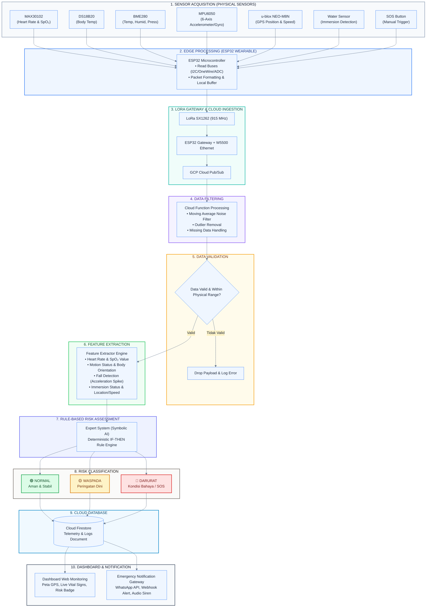

# WearOcean: Workflow AI Risk Assessment & System Architecture

> **Proposal PKM-KC**  
> **Judul:** WearOcean: Rompi Keselamatan Pintar Berbasis IoT untuk Nelayan Pesisir Menggunakan LoRa, Gateway, Cloud Computing, Dashboard Monitoring, dan Rule-Based Risk Assessment.

---

## 📋 Daftar Isi
1. [Ikhtisar Arsitektur Sistem](#1-ikhtisar-arsitektur-sistem)
2. [Diagram Workflow AI Risk Assessment (Square-per-Square Light Mode)](#2-diagram-workflow-ai-risk-assessment-square-per-square-light-mode)
3. [Daftar & Penjelasan Blok Workflow (Step-by-Step)](#3-daftar--penjelasan-blok-workflow-step-by-step)
4. [Matriks Keputusan (Rule-Based Expert System Table)](#4-matriks-keputusan-rule-based-expert-system-table)
5. [Teks Narasi Ilmiah Proposal PKM-KC (Bab 3 / Metode Pelaksanaan)](#5-teks-narasi-ilmiah-proposal-pkm-kc-bab-3--metode-pelaksanaan)

---

## 1. 🏗️ Ikhtisar Arsitektur Sistem

Perangkat **WearOcean** dirancang sebagai *smart wearable safety vest* terintegrasi untuk nelayan pesisir. Sistem memproses data multisensor secara bertingkat (*hierarchical data processing pipeline*) mulai dari akuisisi fisik pada perangkat rompi (*wearable*), dikirimkan via komunikasi radio LoRa (**SX1262**) ke **WearOcean Gateway**, diteruskan ke **Google Cloud Platform (Cloud Pub/Sub, Cloud Function, Firestore)**, hingga ditampilkan pada **Dashboard Monitoring** dan **Emergency Notification**.

```
[ Sensor WearOcean ] ---> (ESP32 Wearable) --- [LoRa 915MHz] ---> (ESP32 Gateway + W5500)
                                                                            │
                                                                       [Ethernet/4G]
                                                                            ▼
[ Alert / Emergency ] <--- [ Dashboard Web ] <--- (Firestore) <--- [ GCP Cloud Function ]
                                                                     (Rule Engine)
```

---

## 2. 🎨 Diagram Workflow AI Risk Assessment (Square-per-Square Light Mode)

### A. Modular Square-per-Square Visual Map (Light Mode Style)

```
┌─────────────────────────────────────────────────────────────────────────────────────────┐
│  [1] SENSOR ACQUISITION (PHYSICAL LAYER)                                               │
│  ┌──────────────┐ ┌──────────────┐ ┌──────────────┐ ┌──────────────┐ ┌──────────────┐   │
│  │   MAX30102   │ │   DS18B20    │ │    BME280    │ │   MPU6050    │ │ NEO-M8N GPS  │   │
│  │ (PPG Sensor) │ │  (Body Temp) │ │ (Environm.)  │ │(6-Axis IMU)  │ │ (Location)   │   │
│  └──────┬───────┘ └──────┬───────┘ └──────┬───────┘ └──────┬───────┘ └──────┬───────┘   │
│         │                │                │                │                │          │
│  ┌──────┴───────┐ ┌──────┴───────┐        │                │                │          │
│  │ Water Sensor │ │  SOS Button  │        │                │                │          │
│  │(Man Overbrd) │ │ (Manual Emer)│        │                │                │          │
│  └──────┬───────┘ └──────┬───────┘        │                │                │          │
└─────────┼────────────────┼────────────────┼────────────────┼────────────────┼──────────┘
          │                │                │                │                │
          ▼                ▼                ▼                ▼                ▼
┌─────────────────────────────────────────────────────────────────────────────────────────┐
│  [2] EDGE PROCESSING & PREPROCESSING (ESP32 WEARABLE)                                   │
│  ┌───────────────────────────────────────────────────────────────────────────────────┐  │
│  │ • Periodic Sensor Polling & I2C/SPI/OneWire Bus Read                             │  │
│  │ • Local Buffer & Time Synchronization                                             │  │
│  │ • Transmit Payload Array via SX1262 LoRa Radio Protocol                           │  │
│  └────────────────────────────────────────┬──────────────────────────────────────────┘  │
└───────────────────────────────────────────┼─────────────────────────────────────────────┘
                                            │ [LoRa Packet Transmission]
                                            ▼
┌─────────────────────────────────────────────────────────────────────────────────────────┐
│  [3] LORA GATEWAY & CLOUD INGESTION (ESP32 GATEWAY + GCP PUB/SUB)                        │
│  ┌───────────────────────────────────────────────────────────────────────────────────┐  │
│  │ • ESP32 Gateway receives LoRa Packet (SX1262)                                    │  │
│  │ • Converts Packet to JSON & Transmits via W5500 Ethernet to GCP Cloud Pub/Sub     │  │
│  └────────────────────────────────────────┬──────────────────────────────────────────┘  │
└───────────────────────────────────────────┼─────────────────────────────────────────────┘
                                            │
                                            ▼
┌─────────────────────────────────────────────────────────────────────────────────────────┐
│  [4] DATA FILTERING (CLOUD FUNCTION PIPELINE)                                           │
│  ┌───────────────────────────────────────────────────────────────────────────────────┐  │
│  │ • Noise Filtering (Moving Average / Median Filter)                                │  │
│  │ • Invalid Data Removal & Outlier Rejection                                        │  │
│  │ • Missing Data Checking & Packet Sequence Validation                              │  │
│  └────────────────────────────────────────┬──────────────────────────────────────────┘  │
└───────────────────────────────────────────┼─────────────────────────────────────────────┘
                                            │
                                            ▼
┌─────────────────────────────────────────────────────────────────────────────────────────┐
│  [5] DATA VALIDATION (INTEGRITY CHECK)                                                  │
│  ┌───────────────────────────────────────────────────────────────────────────────────┐  │
│  │ Check: Physical Limit Range (HR: 30-220 bpm, SpO2: 50-100%, Temp: 20-45°C)         │  │
│  │ [IF INVALID] ──> Drop Payload & Log Warning Event                                  │  │
│  │ [IF VALID]   ──> Pass Clean Data Payload to Feature Extraction Step               │  │
│  └────────────────────────────────────────┬──────────────────────────────────────────┘  │
└───────────────────────────────────────────┼─────────────────────────────────────────────┘
                                            │ [Clean Validated Data]
                                            ▼
┌─────────────────────────────────────────────────────────────────────────────────────────┐
│  [6] FEATURE EXTRACTION (FEATURE ENGINE)                                                │
│  ┌─────────────────────────┐ ┌─────────────────────────┐ ┌──────────────────────────┐  │
│  │   Vital Features        │ │   Motion Features       │ │   Environmental Feat.    │  │
│  │ • Heart Rate (bpm)      │ │ • Motion Status (Idle/   │ │ • Ambient Temp (°C)      │  │
│  │ • SpO2 Level (%)        │ │   Moving/Active)        │ │ • Ambient Humidity (%)   │  │
│  │ • Body Temp (°C)        │ │ • Body Orientation (°)  │ │ • Barometric Press (hPa) │  │
│  └────────────┬────────────┘ │ • Fall Detected (Bool)  │ └────────────┬─────────────┘  │
│               │              └────────────┬────────────┘              │                 │
│  ┌────────────┴────────────┐              │              ┌────────────┴─────────────┐  │
│  │  Spatial & Event Feat.  │              │              │   Emergency Button       │  │
│  │ • Lat, Lon, Speed (kn)  │              │              │ • SOS Pressed (Bool)     │  │
│  │ • Water Detection (Bool)│              │              │                          │  │
│  └────────────┬────────────┘              │              └────────────┬─────────────┘  │
└───────────────┼───────────────────────────┼───────────────────────────┼─────────────────┘
                │                           │                           │
                └───────────────────────────┼───────────────────────────┘
                                            │ [Structured Feature Vector]
                                            ▼
┌─────────────────────────────────────────────────────────────────────────────────────────┐
│  [7] RULE-BASED MULTISENSOR RISK ASSESSMENT (EXPERT SYSTEM ENGINE)                      │
│  ┌───────────────────────────────────────────────────────────────────────────────────┐  │
│  │ Symbolic AI Rule Engine (Evaluates IF-THEN Logic Conditions Deterministically)    │  │
│  │ • Rule 1: IF (Water == TRUE AND Fall == TRUE) ──> Critical Fall/Overboard         │  │
│  │ • Rule 2: IF (SOS == TRUE) ──> Manual SOS Trigger                                  │  │
│  │ • Rule 3: IF (BodyTemp < 35.0°C AND SpO2 < 92%) ──> Hypothermia Risk              │  │
│  │ • Rule 4: IF (HeartRate > 130 bpm AND AmbientTemp > 38°C) ──> Heat Stress/Exhaust.│  │
│  └────────────────────────────────────────┬──────────────────────────────────────────┘  │
└───────────────────────────────────────────┼─────────────────────────────────────────────┘
                                            │
                                            ▼
┌─────────────────────────────────────────────────────────────────────────────────────────┐
│  [8] RISK CLASSIFICATION (STATUS DETERMINATION)                                          │
│  ┌────────────────────────┐ ┌────────────────────────┐ ┌────────────────────────────┐  │
│  │    🟢 NORMAL           │ │    🟡 WASPADA          │ │    🔴 DARURAT              │  │
│  │  Status Aman/Stabil    │ │  Peringatan Dini Risk  │ │  Kondisi Kritis / SOS      │  │
│  └───────────┬────────────┘ └───────────┬────────────┘ └─────────────┬──────────────┘  │
└──────────────┼──────────────────────────┼────────────────────────────┼─────────────────┘
               │                          │                            │
               └──────────────────────────┼────────────────────────────┘
                                          │ [Status + Payload]
                                          ▼
┌─────────────────────────────────────────────────────────────────────────────────────────┐
│  [9] CLOUD DATABASE (FIRESTORE)                                                         │
│  ┌───────────────────────────────────────────────────────────────────────────────────┐  │
│  │ Document Path: /fishermen_logs/{fisherman_id}/telemetry/{timestamp}              │  │
│  │ Data Stored: raw_features, risk_level ("NORMAL"|"WASPADA"|"DARURAT"), gps_loc     │  │
│  └────────────────────────────────────────┬──────────────────────────────────────────┘  │
└───────────────────────────────────────────┼─────────────────────────────────────────────┘
                                            │
                      ┌─────────────────────┴─────────────────────┐
                      ▼                                           ▼
┌───────────────────────────────────────────┐ ┌───────────────────────────────────────────┐
│  [10A] DASHBOARD MONITORING (WEB APPLICATION)│ │  [10B] EMERGENCY NOTIFICATION ENGINE      │
│  ┌─────────────────────────────────────┐  │ │  ┌─────────────────────────────────────┐  │
│  │ • Real-time Map & GPS Vessel Marker │  │ │  │ • Instant Web Dashboard Toast/Audio   │  │
│  │ • Vital Signs Gauge & Sensor Charts │  │ │  │ • WhatsApp Gateway API Alert (Twilio) │  │
│  │ • Risk Level Badge (Green/Yellow/Red)│  │ │  │ • Webhook Call to Emergency Base      │  │
│  └─────────────────────────────────────┘  │ │  └─────────────────────────────────────┘  │
└───────────────────────────────────────────┘ └───────────────────────────────────────────┘
```

---

### B. Mermaid Flowchart (Light Mode Theme)



---

## 3. 🧩 Daftar & Penjelasan Blok Workflow (Step-by-Step)

| No | Blok Workflow | Penanggung Jawab / Teknologi | Deskripsi Input & Pengolahan | Output yang Dihasilkan |
|---|---|---|---|---|
| **1** | **Sensor Acquisition** | Perangkat Hardware Rompi | Pembacaan besaran fisik lingkungan dan tubuh nelayan secara periodik menggunakan sensor terkalibrasi. | Raw Digital/Analog Signal (ADC, I2C, SPI, OneWire, UART). |
| **2** | **Edge Processing** | ESP32 DevKit V1 (Wearable) | Penanganan bus komunikasi sensor, pembentukan struktur *byte payload*, enkapsulasi paket data, dan transmisi nirkabel via SX1262 LoRa. | Paket Data LoRa 915 MHz. |
| **3** | **Gateway & Cloud Ingestion** | ESP32 Gateway + GCP Pub/Sub | Gateway menerima paket LoRa, mengonversi ke format JSON, dan meneruskan ke GCP Cloud Pub/Sub melalui modul W5500 Ethernet. | Message Stream pada GCP Pub/Sub. |
| **4** | **Data Filtering** | GCP Cloud Function | Menerapkan *Moving Average Filter* dan *Outlier Rejection* untuk menghilangkan *noise* akibat pergerakan nelayan atau interferensi gelombang. | Cleaned Data Array (Bebas Spikes & Noise). |
| **5** | **Data Validation** | GCP Cloud Function | Memeriksa kelengkapan atribut payload dan validitas batas fisiologis rasional (misal: HR 30-220 bpm, SpO2 50-100%). Payload tidak logis akan didrop. | Validated Telemetry Data. |
| **6** | **Feature Extraction** | Cloud Processing Engine | Mengolah data mentah menjadi variabel fitur kontekstual (Heart Rate, SpO2, Body Temp, Ambient Temp, Humidity, Pressure, Motion Status, Orientation, Fall Flag, Water Flag, Speed, SOS Status). | Structured Feature Vector. |
| **7** | **Rule-Based Risk Assessment** | Symbolic AI Expert System | Mengevaluasi *Feature Vector* menggunakan matriks aturan logika (*IF-THEN Rules*) deterministik tanpa Machine Learning. | Hasil Evaluasi Logika Risiko Fisiologis & Lingkungan. |
| **8** | **Risk Classification** | Logic Engine Classifier | Mengelompokkan status kondisi nelayan secara tegas ke dalam 3 tingkatan status keselamatan. | Status Klasifikasi: **NORMAL**, **WASPADA**, atau **DARURAT**. |
| **9** | **Cloud Database** | Google Cloud Firestore | Menyimpan seluruh log telemetri, nilai fitur, timestamp, dan status risiko ke database *NoSQL Document Store* secara real-time. | Persistent NoSQL Document Store. |
| **10** | **Dashboard & Notification** | Next.js Web Dashboard & WhatsApp API | Menampilkan visualisasi lokasi GIS, grafik vital signs, serta mengirim notifikasi peringatan seketika saat terjadi kondisi WASPADA atau DARURAT. | Tampilan Dashboard Monitoring & Alert WhatsApp/Webhook. |

---

## 4. 📊 Matriks Keputusan (Rule-Based Expert System Table)

Sistem evaluasi risiko WearOcean menggunakan matriks logika eksplisit (*Symbolic AI Expert System*) sebagai berikut:

```
┌─────────────────────────────────────────────────────────────────────────────────────────────────────────┐
│ ATURAN EVALUASI LOGIKA RISK ASSESSMENT WEAROCEAN                                                      │
├────┬────────────────────────────────────────────────────────────────────────────┬───────────────────────┤
│ ID │ Kondisi Kombinasi Fitur Input                                              │ Status Hasil Output   │
├────┼────────────────────────────────────────────────────────────────────────────┼───────────────────────┤
│ R1 │ SOS_Button == TRUE                                                         │ 🔴 DARURAT            │
│ R2 │ Water_Detected == TRUE AND Fall_Detected == TRUE                           │ 🔴 DARURAT            │
│ R3 │ Water_Detected == TRUE AND Motion_Status == "IMMOBILE"                     │ 🔴 DARURAT            │
│ R4 │ Body_Temp < 34.0°C (Hypothermia Berat) OR SpO2 < 88%                      │ 🔴 DARURAT            │
│ R5 │ Heart_Rate > 150 bpm AND Body_Temp > 39.0°C                                │ 🔴 DARURAT            │
├────┼────────────────────────────────────────────────────────────────────────────┼───────────────────────┤
│ R6 │ Water_Detected == TRUE AND Motion_Status == "ACTIVE"                       │ 🟡 WASPADA            │
│ R7 │ Body_Temp BETWEEN 34.0°C AND 35.5°C (Hypothermia Ringan)                  │ 🟡 WASPADA            │
│ R8 │ Heart_Rate > 120 bpm AND Ambient_Temp > 37.0°C (Kelelahan/Heat Stress)      │ 🟡 WASPADA            │
│ R9 │ Fall_Detected == TRUE AND Water_Detected == FALSE                          │ 🟡 WASPADA            │
│ R10│ SpO2 BETWEEN 88% AND 93%                                                   │ 🟡 WASPADA            │
├────┼────────────────────────────────────────────────────────────────────────────┼───────────────────────┤
│ R11│ Seluruh fitur berada pada rentang batas normal fisiologis & keselamatan    │ 🟢 NORMAL             │
└────┴────────────────────────────────────────────────────────────────────────────┴───────────────────────┘
```

---

## 5. 📝 Teks Narasi Ilmiah Proposal PKM-KC (Bab 3 / Metode Pelaksanaan)

Berikut adalah naskah narasi formal berstandar akademik tinggi yang siap dimasukkan ke dalam proposal **PKM-KC (Bab 3: Tahapan Riset / Metode Pelaksanaan)**:

> **Alur Pemrosesan Data dan Ekstraksi Fitur Multisensor**  
> Sistem keselamatan WearOcean menerapkan alur pemrosesan data bertingkat (*hierarchical data processing pipeline*) untuk menjamin keandalan sistem dalam mendeteksi ancaman keselamatan nelayan secara *real-time*. Sinyal mentah yang ditangkap oleh jajaran sensor (*MAX30102, DS18B20, BME280, MPU6050, GPS u-blox NEO-M8N, Water Sensor,* dan *SOS Button*) pada unit *wearable* terlebih dahulu diolah oleh mikrokontroler ESP32 pada tahap *edge processing* sebelum ditransmisikan melalui sinyal LoRa SX1262 menuju *gateway*. Setelah data tiba di lingkungan *cloud computing* via Cloud Pub/Sub, data tidak langsung dimasukkan ke dalam mesin penilai risiko. Sistem terlebih dahulu menjalankan tahap *Data Filtering* menggunakan *moving average filter* dan *outlier rejection* untuk mengeliminasi *noise* akibat gerak dinamis nelayan serta gelombang laut. Data kemudian melalui tahap *Data Validation* untuk memastikan integritas dan verifikasi rentang fisik rasional; paket data yang korup atau tidak logis akan didrop secara otomatis. Data yang lolos validasi selanjutnya diekstraksi pada tahap *Feature Extraction* untuk mengubah sinyal mentah menjadi parameter situasional yang kaya konteks, seperti laju detak jantung (*Heart Rate*), saturasi oksigen (*SpO₂*), suhu tubuh, suhu dan kelembapan lingkungan, status gerakan, orientasi tubuh, indikasi jatuh (*fall detection*), indikasi perendaman air (*water immersion*), kecepatan kapal, dan status darurat manual.

> **Implementasi Rule-Based Risk Assessment Berbasis Expert System (Symbolic AI)**  
> Evaluasi tingkat risiko keselamatan pada tahapan PKM-KC ini diimplementasikan menggunakan pendekatan *Rule-Based Risk Assessment* yang berbasis pada *Symbolic AI* (*Expert System*). Penggunaan mesin logika aturan eksplisit (*IF-THEN rule engine*) dipilih karena memiliki keunggulan deterministik, latensi eksekusi yang sangat rendah, dapat dijelaskan secara transparan (*explainable AI*), serta tidak membutuhkan komputasi berlebih pada infrastruktur IoT dan *cloud function*. Matriks aturan disusun berdasarkan studi literatur fisiologi keselamatan bahari dan standar medis dasar, di mana variabel hasil ekstraksi fitur dievaluasi secara simultan. Sebagai contoh, kombinasi terdeteksinya perendaman air (*Water Detection*) dan indikasi jatuh (*Fall Detection*) secara otomatis memicu pengkategorian status **DARURAT** (*Man Overboard*), sedangkan kondisi suhu tubuh yang menurun secara gradual di bawah 35,5°C mengaktifkan status **WASPADA** (*Peringatan Dini Hipotermia*). Output dari mesin penilaian risiko ini diklasifikasikan secara tegas ke dalam tiga tingkatan status keselamatan, yaitu **NORMAL**, **WASPADA**, dan **DARURAT**.

> **Pengembangan Model Machine Learning sebagai Roadmap Lanjutan**  
> Pada tahap implementasi PKM-KC saat ini, sistem sengaja belum menerapkan algoritma *Machine Learning* (ML) maupun *Deep Learning* (DL). Hal ini didasari oleh pertimbangan metodologis akademik di mana pelatihan model prediktif berbasis *data-driven* memerlukan ketersediaan dataset riil fisiologis dan aktivitas nelayan pesisir Indonesia dalam jumlah yang memadai, berlabel (*annotated*), serta tervalidasi di lapangan. Penggunaan model ML tanpa ketersediaan dataset aktual yang representatif berisiko tinggi menghasilkan fenomena *overfitting* atau estimasi yang tidak terprediksi pada kondisi ekstrem laut. Oleh karena itu, *Rule-Based Expert System* berfungsi sebagai *baseline model* deterministik yang andal untuk tahap pengujian fungsi sistem (*construct testing*). Selanjutnya, seluruh data telemetri multisensor dan hasil klasifikasi risiko yang tersimpan secara terstruktur pada *Cloud Firestore* akan ditambang dan dijadikan sebagai dataset primer (*ground truth dataset*). Dataset ini akan dimanfaatkan pada roadmap pengembangan pasca-PKM untuk melatih algoritma *Supervised Machine Learning* (seperti *Random Forest* atau *Support Vector Machine*) guna menghasilkan penilaian risiko yang lebih adaptif dan personal di masa mendatang.

---
*WearOcean System Architecture & Workflow Document — Developed for PKM-KC Proposal.*
